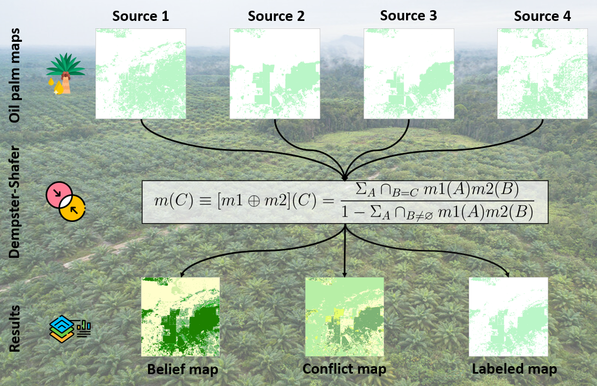

# Applying the Dempster-Shafer Fusion Theory to combine independent land cover products: a case study on the mapping of oil palm plantations in Sumatra, Indonesia


[](https://ieeexplore.ieee.org/document/10641360)


Attention this document is being written! 




## Table of Contents
- [Context](#Context)
- [Usage](#Usage)
- [Features](#Features)
- [Examples](#Examples)
- [References](#References)

## Context

All codes and explanations are taken from the work published in the following article: 

**Please cite this work if you use it.**

This project provides a tool to process spatial data and perform classification using Dempster-Shafer Theory (DST). 
Dempster-Shafer Theory (DST) was develop by **A. Dempster in 1967** and later extended by **G. Shafer in 1976**. It generalizes the Bayesian theory of probability to assess the likelihood of an available evidence. This method is well known and widely used with remote sensing data for its management of uncertainty through the functions of belief and plausibility. It is based on a concept of ignorance to provide sound analysis by not interpreting the lack of information as evidence against an hypothesis (**Lein, 2003**). Its application is based on 4 steps :

- **1. The discernment framework (DF)** sets the hypothesis of the fusion process, i.e. it defines all the possible classes potentially assigned to a pixel:
- **2. The Mass Functions Assignment (MFA)** determines the belief level in each input source, i.e. it assigns numeric mass functions to each pixel depending on its original class.
- **3. The Dempster-Shafer fusion rule** combines the mass functions to estimate the conflict (i.e. uncertainty) and the belief (i.e. confidence) for each pixel to belong to each hypothesis.
- **4. The decision rule (DR)** relies on these metrics to make a final decision, i.e. assign a hypothesis to each pixel.

For more information, see the published article of this work.

## Usage

**If you use these codes, please cite our work:**

To use the codes, you can clone the directory

Clone the repository:
   ```bash
   git clone https://github.com/CarlBethuel/Dempster-Shafer-work.git
```

Attention R packages are required for the use of this code. 

```bash 
install.packages(c("sf", "terra", "tidyverse"))
```
The code is organized by function for a total of 6 functions ranging from the creation of the reference sampling to the validation of the classification derived by the DST. The logic used in the script is applied for two land use classes (Oil Palm and No Oil Palm) and 4 input sources (see [Features] section). The code can be modified depending on the application. 

## Features
This work is based on data from the scientific literature: 

- DESCALS map is provided by **Descals et al., 2021** and is available [here](https://zenodo.org/records/4473715)
- IIASA map is provided by **Danylo et al., 2021** and is available [here](https://github.com/odanylo/oilpalmseasia)
- GAVEAU reference map is provided by **Gaveau et al., 2022** 
- MAPBIOMAS map is provided by **Mapbiomas project** and is available [here](https://mapbiomas.nusantara.earth/)
- Xu map is provided by **Xu et al., 2020** and is available [here](https://zenodo.org/records/3467071)

## Examples

An example of an application is available in the following article: 

## References
- Danylo, Olga, Johannes Pirker, Guido Lemoine, Guido Ceccherini, Linda See, Ian McCallum, Hadi, Florian Kraxner, Frédéric Achard, and Steffen Fritz. 2021. “A Map of the Extent and Year of Detection of Oil Palm Plantations in Indonesia, Malaysia and Thailand.” Scientific Data 8 (1): 96. https://doi.org/10.1038/s41597-021-00867-1.
- Dempster, A. P. 1967. “Upper and Lower Probabilities Induced by a Multivalued Mapping.” The Annals of Math. Stat. 38 (2): 325–39. https://doi.org/10.1214/aoms/1177698950.
- Descals, Adrià, Serge Wich, Erik Meijaard, David L. A. Gaveau, Stephen Peedell, and Zoltan Szantoi. 2021. “High-Resolution Global Map of Smallholder and Industrial Closed-Canopy Oil Palm Plantations.” Earth Syst. Sci. Data 13 (3): 1211–31. https://doi.org/10.5194/essd-13-1211-2021.
- Gaveau, David L. A., Bruno Locatelli, Mohammad A. Salim, Husnayaen, Timer Manurung, Adrià Descals, Arild Angelsen, Erik Meijaard, and Douglas Sheil. 2022. “Slowing Deforestation in Indonesia Follows Declining Oil Palm Expansion and Lower Oil Prices.” PLOS ONE 17 (3). https://doi.org/10.1371/journal.pone.0266178.
- Lein, J. K. 2003. “Applying Evidential Reasoning Methods to Agricultural Land Cover Classification.” International Journal of Remote Sensing, January. https://doi.org/10.1080/0143116031000095916.
- MapBiomas. 2022. “Mapbiomas - Bumi Nusantara.” https://mapbiomas.nusantara.earth/.
- Shafer, Glenn. 1976. A Mathematical Theory of Evidence. Princeton Univ. Press.
- Xu, Yidi, Le Yu, Wei Li, Philippe Ciais, Yuqi Cheng, and Peng Gong. 2020. “Annual Oil Palm Plantation Maps in Malaysia and Indonesia from 2001 to 2016.” Earth Syst. Sci. Data 12 (2): 847–67. https://doi.org/10.5194/essd-12-847-2020.

